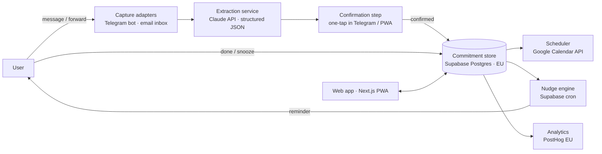

# Wazy — Architecture Doc (Document 1)

> **The brain of the project.** This is the single source of truth for what Wazy is, how it is built, and why.
> Every session (human or AI) starts by reading this file and ends by updating the Session Log.
> If code and this doc disagree, the doc wins until someone updates it on purpose.

| Field | Value |
| --- | --- |
| Project | Wazy |
| Context | ESADE — *Launching AI Native Ventures* |
| Founders | Andrea, David García |
| Doc status | v0.1 — draft, architecture is a proposal to confirm with David |
| Last updated | 2026-10-06 |

---

## 0. How to use this document

1. **Read sections 1–3 before writing any code or prompt.** They define the problem and the rules.
2. **Never break a principle (section 3) silently.** If one must change, log it in section 9 (Decision Log) first.
3. **Before adding a dependency, check section 6.** If it is on the avoid list, it needs a Decision Log entry.
4. **End every working session with an entry in section 10 (Session Log)**, newest first.
5. **Keep it short.** If a section grows past one screen, move detail to a separate doc and link it here.

---

## 1. Venture

**One line:** Wazy is an AI-native assistant that helps busy people capture, schedule and actually execute the small commitments they make every day.

| Element | Current definition |
| --- | --- |
| Problem | Busy people lose track of small commitments ("I'll send it tomorrow", follow-ups, favours, admin) |
| Target users | Students juggling a society or job; young professionals in finance and consulting |
| Origin | Andrea's and David's individual problems merged into one at ESADE Session 2 |
| Role of Wazy today | Treated as **prior art**: the current answer to the problem, not the hypothesis being tested |
| Hypothesis under test | Dropped small commitments are frequent and painful enough for these users to change behaviour |

**Implication for engineering:** everything below is provisional until the problem interviews confirm the hypothesis. Build to learn, not to scale.

---

## 2. System overview

**Core loop:** capture → extract → confirm → store → schedule → nudge → complete → measure.

### Core data model (commitment record)

| Field | Type | Notes |
| --- | --- | --- |
| `id` | uuid | Primary key |
| `user_id` | uuid | Owner (Supabase auth) |
| `what` | text | The action, in the user's words, cleaned by the LLM |
| `for_whom` | text, nullable | Counterpart (person or organisation) |
| `due_at` | timestamptz, nullable | Deadline; null = "soon", resolved by nudge logic |
| `status` | enum | `proposed` · `confirmed` · `scheduled` · `done` · `snoozed` · `dropped` |
| `source` | enum | `telegram` · `email` · `web` |
| `source_ref` | text | Pointer to the origin message, **never the raw content** |
| `confidence` | numeric | Extraction confidence from the model |
| `created_at` / `updated_at` | timestamptz | Audit |

Every surface reads and writes this one record. Nothing else is the source of truth.

---

## 3. Architectural principles

1. **Capture where commitments happen.** Meet users in chat, email and calendar. Do not require them to open a new app to capture.
2. **The LLM proposes, the user confirms.** Nothing is scheduled or sent without a one-tap confirmation.
3. **Thin layer over models and existing tools.** Wazy owns the commitment record and the nudge logic. Models, calendars and messaging stay third-party behind small adapters.
4. **One source of truth.** One structured commitment record (section 2) that every surface uses.
5. **Instrument from day one.** Log every capture, confirmation, nudge and completion. The course is graded on learning; data is the learning.
6. **Privacy by minimum.** Store the extracted commitment, not the raw message. Keep data in the EU.
7. **Replaceable by design.** Any component must be swappable in about a day. No lock-in before validation.

---

## 4. Stack

| Layer | Choice | Why |
| --- | --- | --- |
| Capture | Telegram bot + email forwarding address | Free, set up in hours, no approval process |
| Web app | Next.js PWA on Vercel | One codebase for mobile and desktop, no app-store review |
| Data + auth | Supabase (Postgres, EU region) | Relational record, auth and row-level security included |
| AI extraction | Claude API, structured JSON output | Reliable what / who / when extraction from messy text |
| Scheduling | Google Calendar API (Outlook later) | Most target users live in Google or Microsoft calendars |
| Reminders + jobs | Supabase cron; email via Resend; Telegram messages | Nudges without a separate queue service |
| Analytics | PostHog (EU cloud) | Funnel from capture to completion |

**Most likely to change:** the capture channel (depends on interview results).

### Conventions

- Language: TypeScript everywhere.
- LLM calls: plain API calls from one `extraction` module. Prompts live in versioned files (`/prompts/*.md`), never inline in code.
- Every LLM output is validated against a schema before touching the database.
- Secrets in environment variables only; never committed.

---

## 5. Key flows

**Capture via Telegram**
1. User sends "promised Marta the deck by Friday".
2. Bot forwards text to extraction; model returns `{what, for_whom, due_at, confidence}`.
3. Bot replies with a summary and buttons: Confirm · Edit · Ignore.
4. On Confirm: record saved as `confirmed`, calendar slot proposed, nudge scheduled.

**Capture via email**
1. User forwards an email to their personal Wazy address.
2. Extraction runs on the body; raw email is discarded after extraction.
3. Confirmation request sent by Telegram or email.

**Nudge**
1. Cron checks `confirmed` / `scheduled` commitments approaching `due_at`.
2. Sends one reminder with Done · Snooze · Drop.
3. Response updates status; every event is logged to analytics.

---

## 6. Dependencies to avoid (and why)

| Dependency | Why avoid it now |
| --- | --- |
| WhatsApp Business API | Meta verification, template approval and per-conversation fees cost weeks |
| Full Gmail / Outlook inbox read access | Restricted-scope security review; large privacy liability for little extra signal |
| Agent frameworks (LangChain-style orchestration) | Abstraction over what is one structured LLM call; harder to debug |
| Fine-tuned or self-hosted models | Cost and time with no evidence prompting is insufficient |
| Native iOS / Android apps | Store review and two codebases; a PWA covers the test |
| No-code backends (Bubble, Airtable as DB) | Hard to migrate off; weak for relational commitment data |
| One LLM vendor's proprietary features (assistants, hosted memory) | Ties core logic to one provider; keep prompts and state in our code |
| Paid scheduling platforms (Motion, Reclaim APIs) | Building on prior art / competitors |

Adding any of these requires a Decision Log entry (section 9).

---

## 7. Trade-offs consciously accepted

| We accept | In exchange for | Revisit when |
| --- | --- | --- |
| Telegram + email, not WhatsApp | Shipping in days, zero approval | Interviews show Telegram blocks adoption |
| Manual forwarding, not inbox scanning | Privacy, no security review | Users say forwarding is too much effort |
| Confirmation on every capture (friction) | Trust, no wrong reminders | Extraction accuracy is consistently high |
| Lock-in to Supabase and Vercel | Speed with two founders, no ops | Post-course, if the venture continues |
| LLM cost per message, no caching / routing | Simplicity | Usage exceeds a pilot of a few dozen users |
| No offline mode or native polish | One codebase | A paying segment asks for it |
| Google Calendar first | Covers students fast | Finance / consulting users test it |

---

## 8. Open assumptions

Riskiest first.

| # | Assumption | How we test it | Status |
| --- | --- | --- | --- |
| A1 | Target users regularly drop small commitments and feel a real cost | Session 2 interviews: frequency, last concrete example | Open |
| A2 | Current workarounds fail often enough to switch | Ask what they use today and when it last failed | Open |
| A3 | Users will message / forward a commitment the moment they make it | Concierge test: manual chat capture for one week | Open |
| A4 | An LLM extracts what / who / when accurately from short, messy text | 50 real examples, measure correction rate | Open |
| A5 | A timely nudge, not a list, is what gets things done | Compare completion with and without nudges | Open |
| A6 | Finance / consulting users can use a personal tool under corporate IT rules | Ask Alessio Chiesa and Ferran Minguella | Open |
| A7 | Users accept AI reading commitments if raw messages aren't stored | Ask about data comfort in interviews | Open |

---

## 9. Decision Log

Format: date · decision · why · alternatives rejected. Newest first.

| Date | Decision | Why | Alternatives rejected |
| --- | --- | --- | --- |
| 2026-10-06 | MVP built to the Scope Sheet: Telegram bot only; no email capture, PWA, Calendar, Resend or PostHog | Scope Sheet §2; only A3 is under test | Building the full section 2 system now |
| 2026-10-06 | Identity = Telegram user ID; the record's `user_id` is `telegram_user_id`, no Supabase auth | Scope Sheet: no accounts or login | Supabase auth with magic links |
| 2026-10-06 | One table `commitments` doubles as the event log (timestamps per step: `created_at`, `confirmed_at`, `reminded_at`, `answered_at`, counters for edits and snoozes) | Scope: "one database table"; enough for 15 users | Separate events table; PostHog |
| 2026-10-06 | Status enum adds `ignored` and `not_commitment`; `scheduled` unused in the MVP | Distinguish extraction misses and non-commitments from dropped work; no calendar yet | Mapping Ignore to `dropped` |
| 2026-10-06 | Non-commitment messages are logged only as a short neutral label plus `signals` (`pasted_email`, `calendar_request`, `asked_what_owed`), never the raw text | Founders need these counts for the "3 users did it manually" rule, without breaking principle 6 | Storing raw messages; not logging them at all |
| 2026-10-06 | Bot runs as one long-running Node process: Telegram long polling plus an in-process once-a-minute reminder check, instead of Vercel plus Supabase cron | Runs anywhere with `npm start`, no webhook or cron setup; swappable in a day (principle 7) | Vercel serverless webhook plus Supabase cron |
| 2026-10-06 | Reminder at 09:00 Europe/Madrid on the due date (or the time the user gave); no deadline means tomorrow, shown in the summary so the user can Edit | Scope: "on the due date, one reminder"; nothing is ever silently unscheduled | Leaving `due_at` null |
| 2026-10-06 | Extraction model `claude-opus-5-5` at low effort, with server-side refusal fallback; model configurable via `ANTHROPIC_MODEL` | Accuracy first for A4; cost is negligible at pilot volume | A smaller model before measuring accuracy |
| 2026-10-06 | Adopt this doc as the project's single source of truth | One shared context for founders and AI tools | Scattered notes, chat history |
| Sep 2026 (Session 2) | Merge both founders' problems into "busy people lose track of small commitments"; treat Wazy as prior art | Test the problem before the solution | Testing Wazy as the idea itself |

---

## 10. Session Log

Format: date · session / event · what happened · next. Newest first. **Every session adds a row.**

| Date | Session / event | What happened | Next |
| --- | --- | --- | --- |
| 2026-10-06 | MVP build | Built the Scope Sheet MVP: Telegram bot (capture, Confirm / Edit / Ignore, one reminder with Done / Snooze 1 day / Drop), one `commitments` table, pilot queries in `db/pilot_queries.sql`, tests against a real Postgres. Removed the earlier unrelated Streamlit prototype | Create the bot in BotFather and the Supabase EU project, run it, then recruit 10 to 15 pilot users |
| 2026-10-06 | Architecture doc | Created Document 1 (this file): principles, stack, avoid list, trade-offs, assumptions | Confirm architecture with David; add interview outcomes |
| 22–23 Sep 2026 | Interviews (David) | Planned: Leon Messdag, Philip Popov | Log findings against A1–A7 |
| 21 Sep 2026 | Interview status | 0 of 5 interviews done | Run interviews |
| Sep 2026 | Interviews (Andrea) | Planned: Samuele Leuzzi, Alessio Chiesa (PwC Partner), Ferran Minguella (EIB Investment Director) | Log findings against A1–A7 |
| Sep 2026 | ESADE Session 2 | Problems merged; Wazy reframed as prior art | Interview plan |
